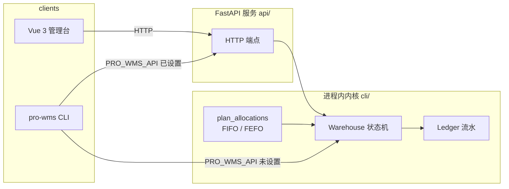

<div align="center">

# pro-wms

**一个把复杂业务当核心卖点的开源仓库管理系统（WMS）**

多仓 · 批次效期 · 波次拣货 · 盘点审批 · 乐观并发

[](https://github.com/gujingchao/pro-wms/actions/workflows/ci.yml)
[](LICENSE)
[](https://www.python.org/)
[](https://github.com/astral-sh/ruff)

</div>

---

大多数开源 WMS demo 止步于"一张库存表加减数量"。pro-wms 反其道而行：**它把仓储业务里真正难的部分做成了一期目标**——不是精简版，而是一套可以直接跑给你看的完整领域模型。

## 它解决什么问题

| 领域难题 | pro-wms 的做法 |
| --- | --- |
| 同一批货批次不同、效期不同，先发哪批？ | 可插拔分配策略：**FIFO**（先进先出）/ **FEFO**（先到期先出），一行配置切换 |
| 过期库存混着好货怎么办？ | 已过效期的批次**永不参与分配**，这是硬规则，不依赖调用方设置 |
| 多个工人同时抢同一批库存？ | **乐观版本号并发控制**：读快照 → 纯函数规划 → 提交时校验版本，冲突方收到明确的 `StockConflict` 而不是静默丢数据 |
| 谁能审批盘点？ | RBAC：`operator` / `supervisor` / `admin`，写操作默认最小权限，**提权必须显式声明** |
| 单据状态被乱序操作打穿？ | 声明式状态机：`draft → allocate → wave → pick/ship`，非法迁移一律拒绝 |
| 流水能不能对上账？ | 每笔变动落 `ledger`，含正负增量与零增量审计行 |

## 特性一览

- **内核即验收**：`pro-wms` CLI 内置并发压测（`race` 命令），不启动任何服务就能复现并验证并发冲突
- **双运行模式**：CLI 默认走进程内内核零依赖运行；设置 `PRO_WMS_API` 即切换为 HTTP 客户端，同一套命令
- **前后端同构契约**：`contracts/openapi.yaml` 对齐 CLI、API 与 Vue 3 管理台
- **演示数据即测试数据**：`seed` 生成的批次效期相对当天计算，演示永远"新鲜"

## 架构



**设计原则**：内核是唯一真相，API 只做薄包装。业务规则写在 `Warehouse` 里，HTTP 状态码映射集中在 API 层一处维护。

## 快速开始

### CLI（30 秒跑通闭环，无需数据库）

```bash
git clone https://github.com/gujingchao/pro-wms.git
cd pro-wms/cli
python -m venv .venv && source .venv/bin/activate   # Windows: .venv\Scripts\Activate.ps1
pip install -e ".[dev]"

pro-wms seed                                        # 装入演示数据
pro-wms inbound-receive IN-1001                     # 收货
pro-wms inbound-putaway IN-1001 --to EAST-A-01-01   # 上架
pro-wms outbound-allocate OUT-2001 --strategy fefo  # FEFO 分配
pro-wms wave-create --outbounds OUT-2001            # 建波次
pro-wms wave-pick WV-2001                           # 拣货发运
pro-wms ledger --sku SKU-MILK                       # 查流水

pro-wms race --workers 8                            # 并发压测：验证乐观锁
```

### API + 管理台

```bash
# 1. 启动 API（先本地安装 cli，它未发布到 PyPI）
cd api && pip install -e ../cli && pip install -e ".[dev]"
uvicorn app.main:app --port 8080

# 2. 启动管理台
cd web && npm install && npm run dev    # http://localhost:5173
```

## 文档

| 文档 | 内容 |
| --- | --- |
| [`docs/allocation.md`](docs/allocation.md) | FIFO/FEFO 排序键、过期规则、乐观并发设计 |
| [`docs/style.md`](docs/style.md) | 编码与文档规范 |
| [`CONTRIBUTING.md`](CONTRIBUTING.md) | 如何参与开发 |
| [`api/README.md`](api/README.md) | 接口清单、身份与错误映射 |
| [`web/README.md`](web/README.md) | 管理台功能与开发 |
| [`contracts/openapi.yaml`](contracts/openapi.yaml) | HTTP 契约 |

## 项目状态

CLI 与 API 已可用且测试覆盖完整（含并发竞态）。以下能力在路线图中，欢迎认领：

- [ ] Postgres 持久化（物理模型草案见 [`infra/init.sql`](infra/init.sql)），内核仍为进程内实现
- [ ] Redis 热点锁与缓存
- [ ] `api/Dockerfile` 与完整 Docker Compose 部署
- [ ] 真实鉴权（当前 `X-User` 为客户端自证，仅适合演示与内网）

## 参与贡献

欢迎 Issue 与 PR。提交前请确认：

```bash
cd cli && ruff check . && pytest
cd ../api && ruff check . && pytest -q
```

规范细节见 [`CONTRIBUTING.md`](CONTRIBUTING.md)。

## License

[MIT](LICENSE)
